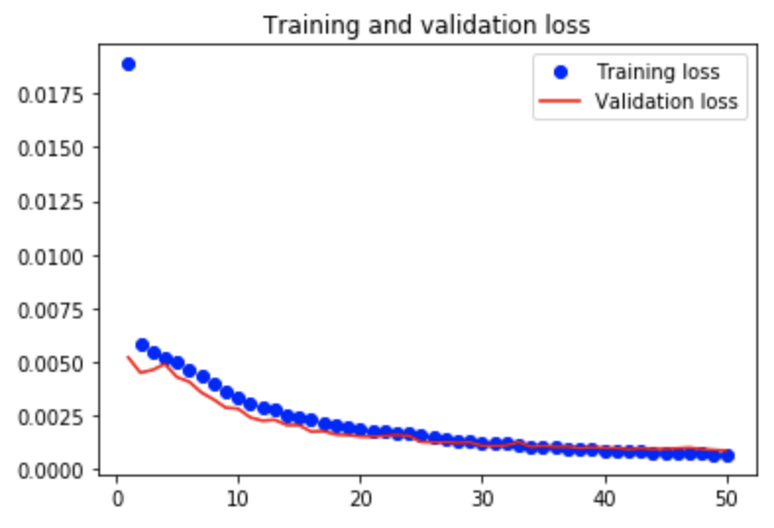

[//]: # (Image References)

[image1]: ./images/obamas_with_keypoints.png "Facial Keypoint Detection"

# Facial Keypoint Detection and Real-time Filtering

## Project Overview

This is my computer vision capstone project for the AI Nanodegree program at Udacity! In this project, I built an end-to-end facial keypoint recognition system. Facial keypoints include points around the eyes, nose, and mouth on any face and are used in many applications, from facial tracking to emotion recognition. My completed model can take in any image containing faces and identify the location of each face and their facial keypoints, as shown above.

![Facial Keypoint Detection][image1]

## Beginning

I started this project by experimenting with the OpenCV library and after identifying faces in an image, I used the filter2D function to blur out the cropped region of the faces.  I then decided to implement a solution that could blur faces in real time using a computer's webcam.

## Complete Pipeline

The pipeline consists of the following steps:

* Accept a color image
* Convert the image to grayscale
* Detect and crop the faces contained in the image
* Locate the facial keypoints in the cropped image
* Overlay the facial keypoints in the original (color, uncropped) image

I used a pre-trained face detector from OpenCV to identify each face in the image and I developed a CNN for predicting the locations of facial keypoints. The model accepts 96×96 grayscale images as input, and it outputs a vector with 30 entries, corresponding to the predicted (horizontal and vertical) locations of 15 facial keypoints.

## Model Results

